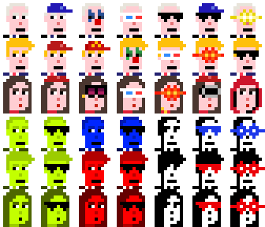
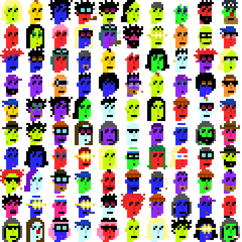
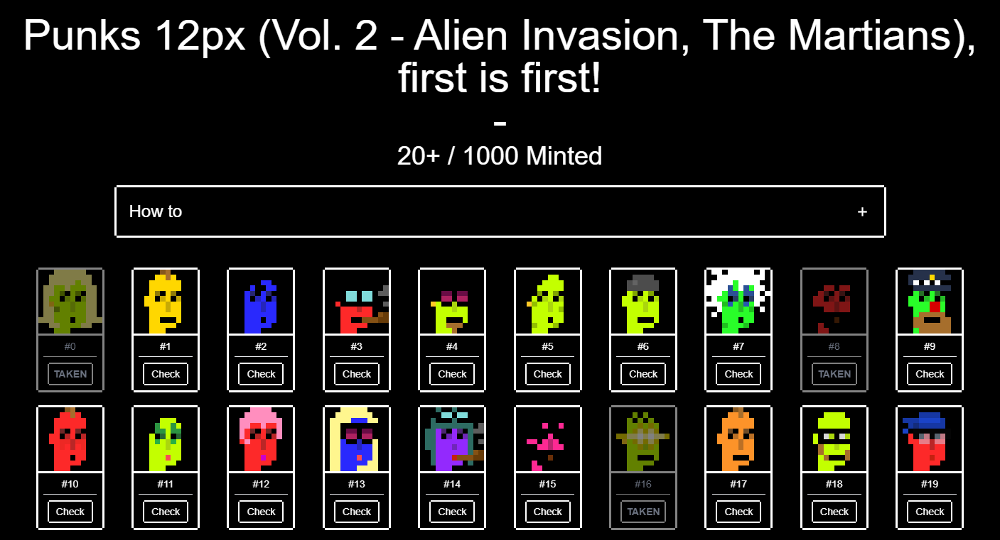
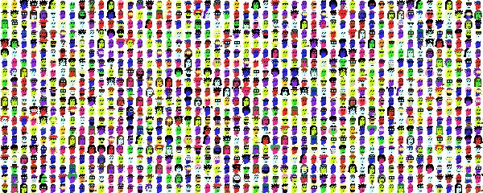

Looking for the Bitscoin Edition?  See [Punks 12px @ orc721 »](https://github.com/orc721/punks12px) 


# Punks 12px, The Facet & Ethscribe Editions

## What's News?


Presidents!   Twenty-One + Twenty-One (Fourty-Two) New Punks 12px to mint via facet nfts (0.0015 eth + network fees).

Pork! Forty-Two + Forty-Two (Eighty-Four) New Punks 12px free to self-inscribe, first-is-first. Ty. All 84 minted.


For updates, see <https://twitter.com/punks12px_eth>.


## The Facet Edition

### Presidents (42 max.) -  Joe, Donald & Nikki - MINTING NOW!

The presidents (punk) fam in 4x




**Mint Web** 

See <https://facetnft.com/collection/presidents-punks-12px>

note: the metadata for the mint is shuffled (that is, random) and is 0.0015 eth + network fees


Find all meta data in the [presidents/presidents12px.csv](presidents/presidents12px.csv) tabular dataset e.g.

```
id, type, attributes
1,  joe,
2,   joe, cap blue
3,   joe, clown eyes blue / clown nose 
4,   joe, 3d glasses
5,   joe, regular shades
6,   joe, cap blue / regular shades
7,   joe, laser eyes gold
8,   donald,
9,   donald, cap red
10,   donald, cap mcd
...
```


## The Ethscribe Editions (First-is-First, Free Self-Inscribe Mint)


See [**Vol. 1 - The Classics (Max. 10000) »**](https://github.com/0xCompute/punks12px.vol1)


### Vol. 2 - Alien Invasion, The Martians (Max. 1000)

The first hundred martian (alien punk) 12px fam in 4x




**Mint web**

  - <https://0xcompute.github.io/punks12px>





**Marketplace**

  - SOON!


Find all indexed / confirmed ethscriptions mints in the [martians/mint.csv](martians/mint.csv) tabular dataset e.g.

```
num, ref
4104972, 0
4104979, 16
4104981, 54
4104982, 58
4105375, 8
4105601, 534
4105608, 998
4105614, 453
4105633, 945
4105634, 896
...
```


Find all 1000 reference images (12×12px) in [**martians/ethscribe**](martians/ethscribe):


...
...


Find all meta data in the [martians/martians12px.csv](martians/martians12px.csv) tabular dataset e.g.

```
id, type, attributes
0, Alien Lime Female, Blonde Bob / Mole / Earring
1, Alien Gold, Mohawk
2, Alien Blue Female, Wild Hair
3, Alien Red, Wild Hair / Pipe / Nerd Glasses
4, Alien Lime, Goat / Wild Hair / Big Shades / Earring
5, Alien Lime Female, Half Shaved / Spots / Earring
6, Alien Lime, Do-rag
7, Alien Green Female, Spots / Wild White Hair / Clown Eyes Blue
8, Alien Red, Luxurious Beard / Messy Hair
9, Alien Green, Big Beard / Police Cap / Clown Nose
...
```

**Bonus - All together now**

Find the composite fam image of all 1000 in a 50×20 grid in [martians/martians12px.png](martians/martians12px.png) (~50k - 640×240px).




### Vol. 3 - Pork, Piggy Punks (Max. 84) - MINTED OUT!

The pork (punk) fam in 4x


**Markets**

see <https://ordex.io/collection/eth/pork12px>


**Mint** 

Find all indexed / confirmed ethscriptions mints in the [pork/mint.csv](pork/mint.csv) tabular dataset e.g.

```
num, ref
5574631, 2
5574633, 0
5574692, 9
5575066, 10
5575073, 14
...
```


Find all reference images (12×12px) one-by-one (in .PNG) 
in the [**pork/ethscribe**](pork/ethscribe) directory:


...


Find all meta data in the [pork/pork12px.csv](pork/pork12px.csv) tabular dataset e.g.

```
id, type, attributes
 0,  pork, 
 1,  pork, regular shades / red mohawk  
 2,  pork, 3d glasses
 3,  pork, cap 
 4,  pork, cap forward / pipe
 5,  pork, laser eyes gold
 6,  pork, vr pro
 7,  pork, clown eyes green
 8,  pork, cap mcd
 9,  pork, hoodie 
...
```


## Questions? Comments?

Join us in the [0xCompute discord (chat server)](https://discord.gg/3JRnDUap6y). Yes you can.
Your questions and commentary welcome.

Or post them over at the [Help & Support](https://github.com/geraldb/help) page. Thanks.
