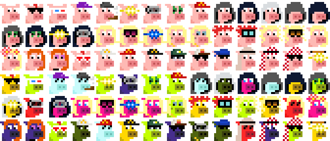

Looking for the Bitscoin Edition?  See [Punks 12px @ orc721 »](https://github.com/orc721/punks12px) 


# Punks 12px, The Facet & Ethscribe Editions

## What's News?


Presidents!   Twenty-One + Twenty-One (Fourty-Two) New Punks 12px to mint via facet nfts (0015 eth + network fees).

Pork! Forty-Two + Forty-Two (Eighty-Four) New Punks 12px free to self-inscribe, first-is-first. Ty. All 84 minted.


For updates, see <https://twitter.com/punks12px_eth>.


## The Facet Edition

### Presidents (42 max.) -  Joe, Donald & Nikki

The presidents (punk) fam in 4x


**Mint Web** 

See <https://facetnft.com/collection/presidents-punks-12px>

note: the metadata for the mint is shuffled (that is, random) and is 0.0015 eth + network fees


Find all meta data in the [presidents/presidents12px.csv](presidents/presidents12px.csv) tabular dataset e.g.

```
id, type, attributes
1,  joe,
2,   joe, cap blue
3,   joe, clown eyes blue / clown nose 
4,   joe, 3d glasses
5,   joe, regular shades
6,   joe, cap blue / regular shades
7,   joe, laser eyes gold
8,   donald,
9,   donald, cap red
10,   donald, cap mcd
...
```


## The Ethscribe Editions

See [**Vol. 1 - The Classics (Max. 10000) »**](https://github.com/0xCompute/punks12px.vol1)

See [**Vol. 2 - Alien Invasion, The Martians (Max. 1000) »**](https://github.com/0xCompute/punks12px.vol2)


## Vol. 3 & Beyond


### Pork (max. 84) - Piggy Punks - First-is-First, Self-Inscribe Mint

The pork (punk) fam in 4x




**Markets**

see <https://ordex.io/collection/eth/pork12px>


**Mint** 

Find all indexed / confirmed ethscriptions mints in the [pork/mint.csv](pork/mint.csv) tabular dataset e.g.

```
num, ref
5574631, 2
5574633, 0
5574692, 9
5575066, 10
5575073, 14
...
```


Find all reference images (12×12px) one-by-one (in .PNG) 
in the [**pork/ethscribe**](pork/ethscribe) directory:


...


Find all meta data in the [pork/pork12px.csv](pork/pork12px.csv) tabular dataset e.g.

```
id, type, attributes
 0,  pork, 
 1,  pork, regular shades / red mohawk  
 2,  pork, 3d glasses
 3,  pork, cap 
 4,  pork, cap forward / pipe
 5,  pork, laser eyes gold
 6,  pork, vr pro
 7,  pork, clown eyes green
 8,  pork, cap mcd
 9,  pork, hoodie 
...
```


## Questions? Comments?

Join us in the [0xCompute discord (chat server)](https://discord.gg/3JRnDUap6y). Yes you can.
Your questions and commentary welcome.

Or post them over at the [Help & Support](https://github.com/geraldb/help) page. Thanks.
